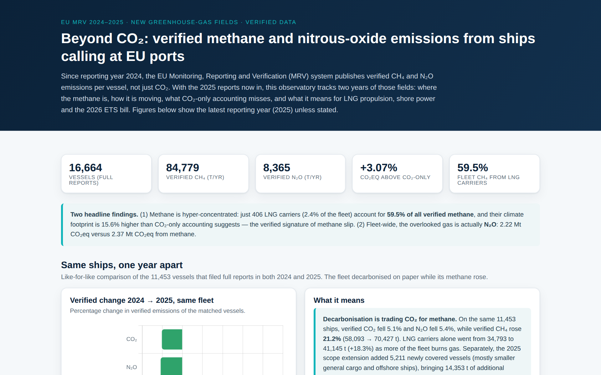
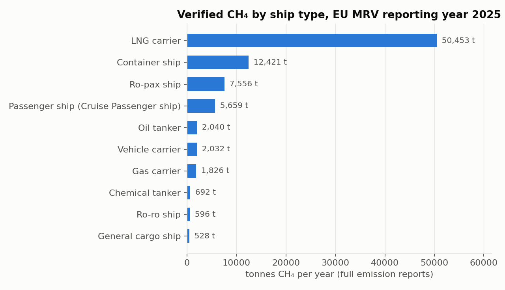
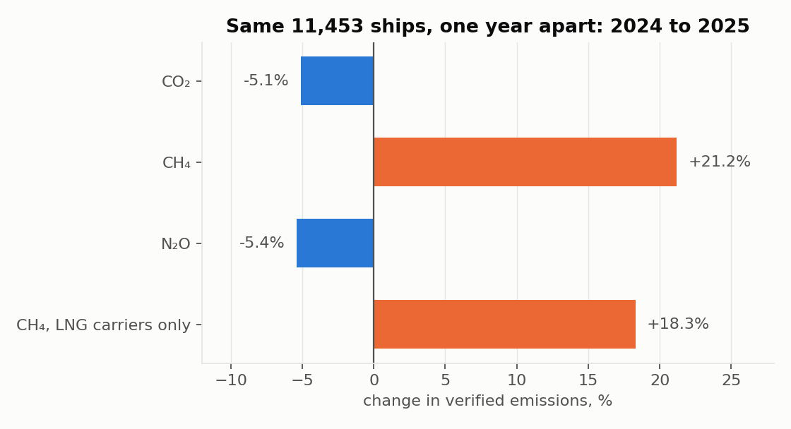
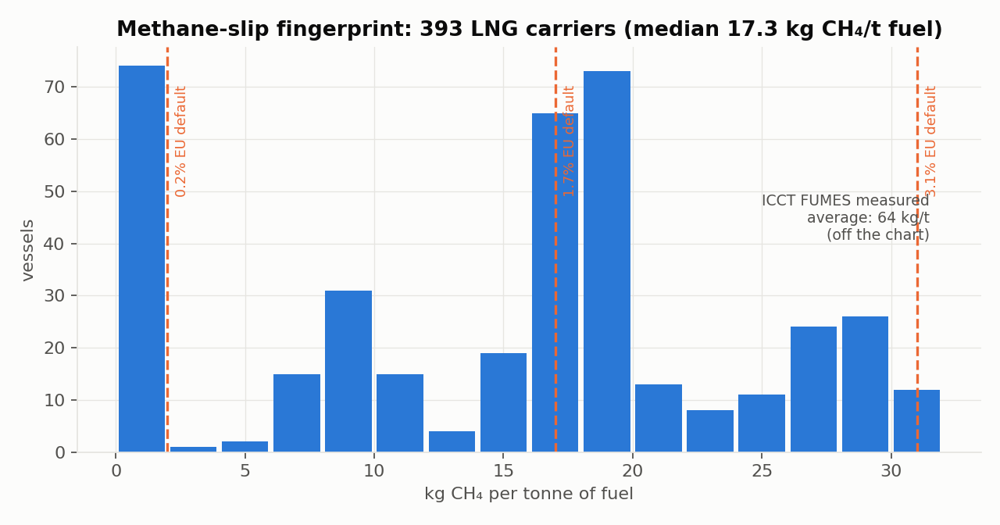
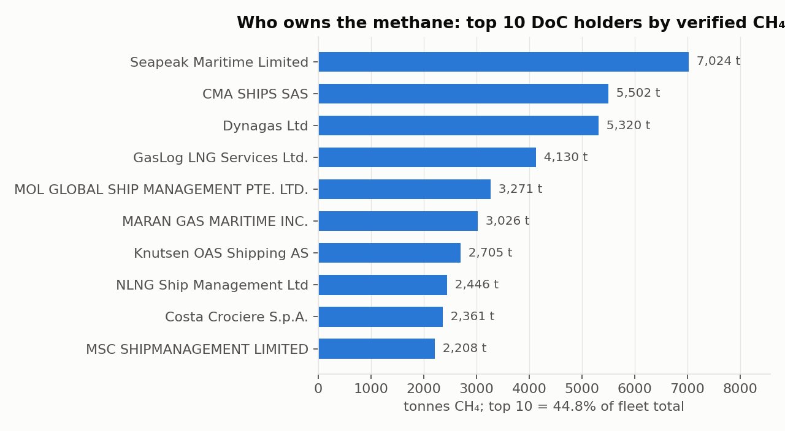

# Shipping Methane Monitor

**Verified CH₄ and N₂O emissions from ships calling at EU ports: two years of evidence from the EU MRV greenhouse-gas fields (2024–2025)**

[](https://doi.org/10.5281/zenodo.21144287)
[](https://shipping-methane-monitor.vercel.app/)
[](LICENSE)
[](https://mrv.emsa.europa.eu/)

<p align="center">
  
</p>

## What this is

Since reporting year 2024, every vessel above 5,000 GT calling at EU ports must report **verified CH₄ and N₂O emissions** alongside CO₂ (Regulation (EU) 2023/957). This project reads the two public EMSA files (2024 and 2025), aggregates them into one `data.json`, and publishes the result as a static, dependency-free website. It is the first open observatory of these new fields.

**Headline finding: decarbonisation is trading CO₂ for methane.** On the 11,453 vessels that filed full reports in both years, verified CO₂ fell 5.1% while verified CH₄ rose 21.2%.

| Verified emissions, same 11,453 ships | 2024 → 2025 | Change |
|---|---|---|
| CO₂ | 131.3 → 124.7 Mt | **−5.1%** |
| CH₄ | 58,093 → 70,427 t | **+21.2%** |
| N₂O | 7,390 → 6,990 t | −5.4% |
| CH₄, LNG carriers only (293 ships) | 34,793 → 41,145 t | +18.3% |

Reporting year 2025 in full: 16,664 vessels with full emission reports, 84,779 t of verified CH₄, of which 59.5% from 406 LNG carriers.

## Gallery

| Where the methane comes from | Same ships, one year apart |
|---|---|
|  |  |
| **Methane-slip fingerprint** | **Who owns the methane** |
|  |  |

The slip histogram shows CH₄ intensity of LNG carriers clustering on the EU default slip factors (0.2%, 1.7% and 3.1% of fuel mass). The ICCT FUMES campaign measured a real-world average of 6.4% for LNG Otto 4-stroke engines, twice the highest default: reported totals are a lower bound.

## Observatory modules

| Module | Finding |
|---|---|
| Same ships, one year apart | Year-on-year table above, computed only on vessels present in both years |
| Who owns the methane | The top 10 DoC holders concentrate 44.8% of all verified CH₄; LNG-fuelled passenger fleets rank alongside LNG-carrier operators |
| Methane-slip fingerprint | 393 LNG carriers, median 17.3 kg CH₄ per tonne of fuel |
| The 2026 ETS methane bill | ETS-scoped CH₄ (30,532 t) and N₂O (4,816 t) equal 2.13 Mt CO₂eq: €170.5 M per year at €80 per allowance, based on the 2024 file |

## Reproducing

1. Download the *Publication of information* files for the 2024 and 2025 reporting periods from [EMSA / THETIS-MRV](https://mrv.emsa.europa.eu/) (free, no registration).
2. Rebuild the aggregated indicators:

```bash
python3 build_data.py path/to/mrv_2024.xlsx path/to/mrv_2025.xlsx
```

3. Preview or deploy the static site:

```bash
python3 -m http.server        # http://localhost:8000
vercel --prod                 # or import the repo at vercel.com, framework: Other
```

The page fetches `data.json`, so it must be served over HTTP (opening `index.html` directly from disk shows empty cards).

## Repository map

| Path | Content |
|---|---|
| `index.html` | Single-page site (Chart.js from CDN, no build step) |
| `data.json` | Aggregated indicators consumed by the page |
| `build_data.py` | Regenerates `data.json` from the two EMSA source files |
| `docs/gallery/` | Figures used in this README |
| `CITATION.cff` | Citation metadata (GitHub's *Cite this repository* button) |

## Method notes

- Only **full emission reports** are included; the year-on-year module compares only vessels present in both years, isolating the 2025 scope extension (5,211 newly covered vessels, mostly general cargo and offshore ships).
- CO₂eq uses GWP₁₀₀ from IPCC AR5 (CH₄ = 28, N₂O = 265), the values applied by the EU MRV/ETS framework.
- *Verified* means checked by accredited verifiers against approved monitoring plans; emission factors are fuel-based defaults, so actual methane slip may exceed reported values for some engine types.
- Ship types with fewer than 20 full reports are excluded from the by-type table.
- ETS-scoped CH₄/N₂O columns are empty in the 2025 file (the surrender obligation for these gases starts with 2026 emissions); the ETS module therefore uses the 2024 file.

References: EU default slip factors from the FuelEU Maritime and MRV implementing rules; real-world slip from ICCT, *Fugitive and Unburned Methane Emissions from Ships (FUMES)*, 2024.

## Related projects

- [shipping-carbon-costs](https://github.com/darlianecunha/shipping-carbon-costs): 3,303 companies ranked by EU ETS carbon cost
- [vessel-efficiency-ml](https://github.com/darlianecunha/vessel-efficiency-ml): predicting CO₂ efficiency grades from EU MRV data
- [eu-ports-no2](https://github.com/darlianecunha/eu-ports-no2): NO₂ over European ports from Sentinel-5P

## How to cite

Metadata in [`CITATION.cff`](CITATION.cff); GitHub's *Cite this repository* button produces APA and BibTeX.

> Cunha, D. R. (2026). *Shipping Methane Monitor: verified CH₄ and N₂O emissions from ships calling at EU ports, EU MRV 2024–2025* (Version 2.0) [Software and dataset]. Zenodo. https://doi.org/10.5281/zenodo.21144287

```bibtex
@software{cunha2026methane,
  author    = {Cunha, Darliane Ribeiro},
  title     = {Shipping Methane Monitor: verified CH4 and N2O emissions from ships calling at EU ports, EU MRV 2024--2025},
  year      = {2026},
  version   = {2.0},
  publisher = {Zenodo},
  doi       = {10.5281/zenodo.21144287},
  url       = {https://shipping-methane-monitor.vercel.app/}
}
```

## Author and licence

**Darliane Ribeiro Cunha, PhD**. Research: maritime decarbonisation, port sustainability analytics, SDG implementation. [ribeirocunha.com](https://ribeirocunha.com) · [ORCID 0000-0003-2548-1237](https://orcid.org/0000-0003-2548-1237)

Data: © European Maritime Safety Agency (EMSA), public information. Analysis, figures and site: [CC BY 4.0](LICENSE).
